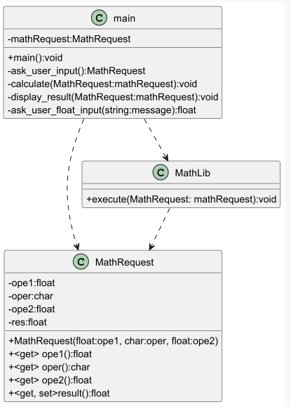

# Calculator

Ce dépôt a été créé à des fins pédagogiques. Il permet de s'entraîner à l'utilisation de git-flow tout comme à s'initier à la programmation orientée objet.

## Comment débuter le travail

Précédemment nous avons intégré la classe "MathRequest" permettant de regrouper dans une même structure les différentes variables définissant un calcul.

Pour cette étape, il s'agit de continuer de faire évoluer l'architecture en retirant la logique mathématique actuellement présente dans le main, pour la disposer dans une classe dédiée au xmathématiques.

## Backlog
### Tâche 01 - Etudier le diagramme de classes



Identifiez les différentes relations entre main, MathRequest et MathLib.

Observez également l'architecture de chacune des classes.

### Tâche 02 - Prendre en main le code de départ

L'état du projet actuel est le suivant:
* La classe de test "testMathLib" est prête pour le développement. En lançant la série de test vous devirez avoir ce résultat.


## Tâche 03 - Enrichissement fonctionnel de la méthode "execute"

En vous concentrant sur chaque cas de tests séparemment, enrichissez la méthode "execute" de MathLib.

Votre branche feature "MathLib" devrait contenir la liste des commits suivants:

1. "feat: add impl"
2. "feat: sub impl"

et ainsi de suite pour toutes les opérations.

Si vous détectez des erreurs, utiliser des commits de type "fix:".

## Tâche 04 - Adapter le "main" pour qu'il exploite la nouvelle classe "MathLib"

Une fois que votre classe "MathLib" passe tous les tests, vous pouvez l'intégrer au "main".

Ceci fait, vous pourrez clore la branche feature/MathLib comme suit:

```
   git flow feature finish MathLib
```

## Tâche 05 - Etat final

En local, vous ne devriez avoir plus que deux branches, la "develop" et la "main".
A distantce, vérifiez également que vous n'avez bien le même état.

Une session de test "manuelle" à l'aide de la console permet de valider que toutes les opérations fonctionnent (sans gestion d'exception).
Une session de test "automatique" à l'aide des classes de tests vous permet de valider que le code répond aux exigences.

Soignez votre code, relisez-le attentivement en vous aider des informations émises par votre IDE.

Si vous apportez des améliorations, faites-le directement dans la branche develop.
